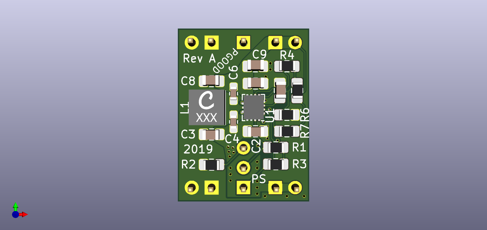
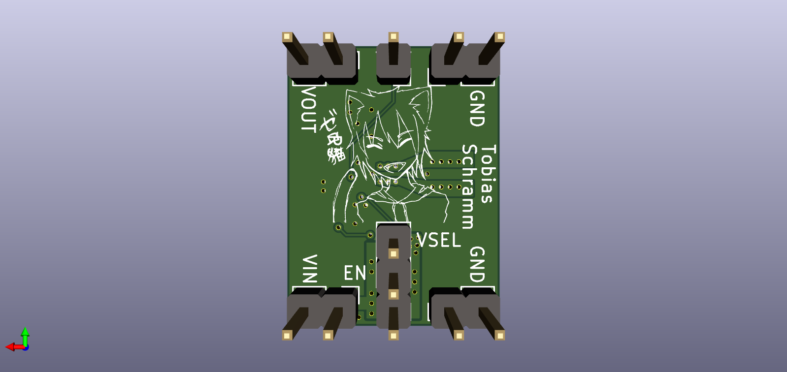

2 - 16 V step-up/down module
============================

Simple 2 - 16 V step-up/down DC-DC module, footprint-compatible to MP1584EN

Optional headers for regulator control and power good signals.

# PCB

## Top

## Bottom

# Library

This design comes with reference KiCAD module schematic symbols, footprints
and 3d models. Copy

* models
* tps63070-module.lib
* tps63070-module.pretty

to the root of your project and include the schematic symbols from
`tps63070-module.lib` as well as the footprints from `tps63070-module.pretty`.
